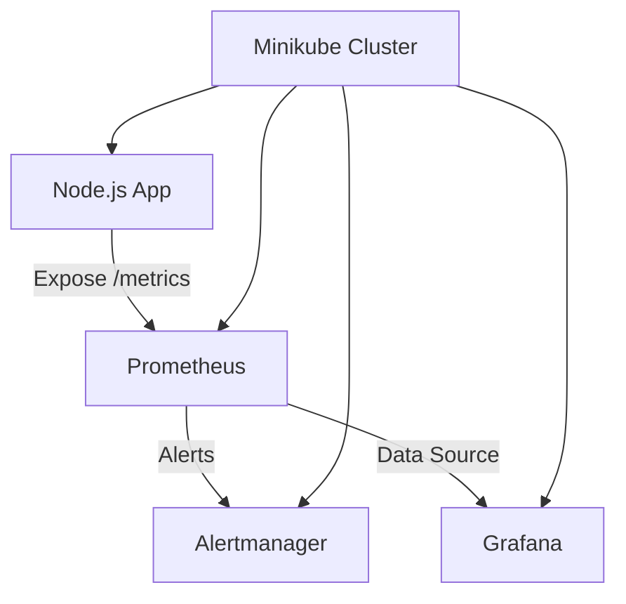

# Kubernetes Monitoring with Prometheus & Grafana

🚀 **End-to-end Kubernetes Monitoring Stack** deployed on **Minikube** using Prometheus, Grafana, and Node Exporter.  
This project demonstrates deploying a Node.js app to Kubernetes, exposing metrics via `/metrics`, and visualizing cluster + app performance in Grafana.

---

## 📌 Features
- ✅ Node.js web application deployed on Kubernetes (Minikube)
- ✅ Metrics exposed at `/metrics` endpoint
- ✅ Prometheus setup to scrape application + cluster metrics
- ✅ Alertmanager integration with Prometheus rules
- ✅ Grafana dashboards for real-time visualization
- ✅ Local development using Minikube & Docker Desktop

---

## 🏗️ Architecture


---

## ⚙️ Tech Stack
- **Kubernetes (Minikube)**
- **Docker Desktop**
- **Prometheus** (metrics scraping)
- **Grafana** (visualization)
- **Alertmanager** (alert handling)
- **Node.js** (sample web app with metrics)

---

## 🚀 Setup & Deployment

### 1️⃣ Start Minikube
```bash
minikube start --driver=docker
```

### 2️⃣ Deploy the Node.js App
```bash
kubectl apply -f k8s/deployment.yaml
kubectl apply -f k8s/service.yaml
```

### 3️⃣ Deploy Prometheus & Grafana (via kube-prometheus-stack)
```bash
helm repo add prometheus-community https://prometheus-community.github.io/helm-charts
helm install monitoring prometheus-community/kube-prometheus-stack -n monitoring --create-namespace
```

### 4️⃣ Access Services
- **Node.js app** → `127.0.0.1:<port>`  
- **Prometheus** → [http://127.0.0.1:9090](http://127.0.0.1:9090)  
- **Grafana** → [http://127.0.0.1:3000](http://127.0.0.1:3000) (default user: `admin`)  

---

## 📊 Screenshots

### 1. Node.js App Metrics


### 2. Prometheus Targets


### 3. Prometheus Rules & Alerts


### 4. Grafana Dashboard (Cluster Monitoring)


### 5. Grafana Dashboard (Node.js Metrics)


---

## 🔮 Future Enhancements
- Add **custom Grafana dashboards** for detailed app performance  
- Integrate **Slack/Email alerts** via Alertmanager  
- Deploy on **cloud Kubernetes (EKS/GKE/AKS)**  
- CI/CD integration for automated deployments  

---

## 📜 License
MIT License © 2025 Ekansh Pandey
